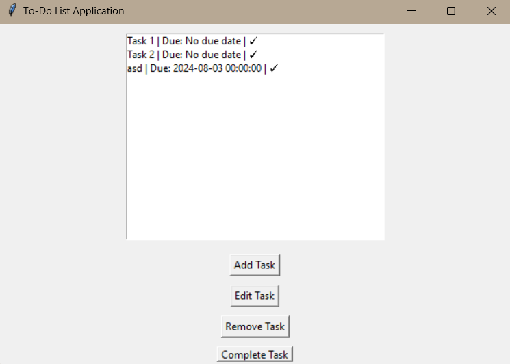

```markdown
# To-Do List Application

A simple, user-friendly To-Do List application built with Python and Tkinter. This application helps you manage your tasks effectively by allowing you to add, edit, complete, and delete tasks with a graphical interface.

## 🎯 Features

- **Add Tasks**: Create new tasks with a title, description, and due date using a calendar widget.
- **Edit Tasks**: Modify task details at any time.
- **Complete**: Mark tasks as complete.
- **Remove Tasks**: Delete tasks when they are no longer needed.
- **Persistent Storage**: Automatically saves tasks to a JSON file and loads them on startup.

## 🛠️ Requirements

- **Python 3.x**
- **tkcalendar==1.6.1**
- **pytest==7.1.2** (optional, for testing)

## 📦 Installation

1. **Clone the repository:**

   ```bash
   git clone https://github.com/KemalSahin2001/To-Do-App.git
   cd To-Do-App
```

2. **Install dependencies:**

   ```bash
   pip install -r requirements.txt
   ```
3. **Run the application:**

   ```bash
   python main.py
   ```

## 📚 Usage

1. **Launch the Application**: Run `main.py` to open the To-Do List application.
2. **Add a Task**: Click "Add Task" and enter the task details.
3. **Edit a Task**: Select a task from the list and click "Edit Task" to update its details.
4. **Complete a Task**: Select a task and click "Complete Task" to mark it as done.
5. **Uncheck a Task**: Select a completed task and click "Uncheck Task" to mark it as incomplete.
6. **Remove a Task**: Select a task and click "Remove Task" to delete it.
7. **Save and Exit**: Click "Save and Exit" to store your tasks in a JSON file.

## 🎨 Screenshots

### Main Application Window



## 🧪 Testing

This project includes a `tests` directory with placeholders for test cases using `pytest`. Testing can help ensure that the application functions as expected and makes it easier to catch any bugs.

To run the tests, use the following command:

```bash
pytest
```

*Note: Test implementations are currently planned but not yet completed.*

## 🌟 Contributing

Contributions are welcome! Please follow these steps:

1. **Fork the repository**.
2. **Create a new branch**: `git checkout -b feature-name`.
3. **Commit your changes**: `git commit -am 'Add new feature'`.
4. **Push to the branch**: `git push origin feature-name`.
5. **Open a Pull Request**.

## 📄 License

This project is licensed under the MIT License - see the [LICENSE](LICENSE) file for details.

## 🙏 Acknowledgments

- **[Tkcalendar](https://github.com/j4321/tkcalendar)**: For providing the excellent date picker widget.
- **Inspiration**: Thanks to various task management tools for inspiration in developing this application.

## 📬 Contact

For any questions or feedback, please reach out to [kmlshnbusiness@gmail.com](mailto:kmlshnbusiness@gmail.com).

---

Made with ❤️ by [Kemal Şahin](https://github.com/KemalSahin2001)

```

### Explanation of Changes

1. **Correct Image Path**: The path to your image is now `todo_app/tests/img/gui.png`. Ensure that this matches your repository structure exactly as GitHub is case-sensitive and path-sensitive.

2. **Contact Information**: Updated with your email address for feedback and questions.

3. **GitHub Repository URL**: Updated to `https://github.com/KemalSahin2001/To-Do-App.git` for accurate clone instructions.

4. **Name and Profile**: Personalized with your GitHub profile link and name.

### Steps to Finalize

1. **Check Image Path**: Double-check that the `gui.png` image path matches exactly in the repository. If the path is different, adjust accordingly.

2. **Push `README.md` to GitHub**: Once you've ensured all paths are correct, push your changes to GitHub.

```bash
git add README.md
git commit -m "Add README.md with project details and image"
git push
```

### Verify on GitHub

1. **Navigate to Your GitHub Repository**: [To-Do-App on GitHub](https://github.com/KemalSahin2001/To-Do-App)
2. **Check the `README.md` Rendering**: Ensure that the image displays correctly and all links work as expected.
3. **Review**: Look for any issues with formatting or content that you might want to refine further.

### Conclusion

Your project now has a well-documented `README.md` that outlines its features, setup instructions, and usage. This not only makes it easier for others to understand and use your application but also encourages contributions.

Feel free to make any further customizations, and if you have any questions or need additional changes, let me know!
